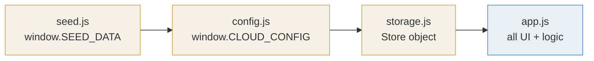
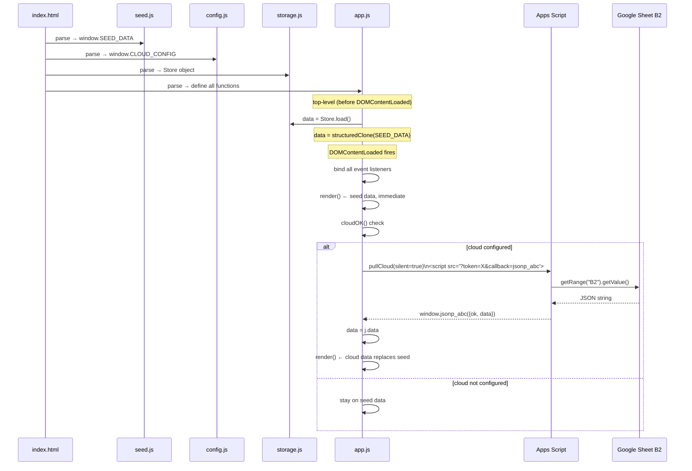
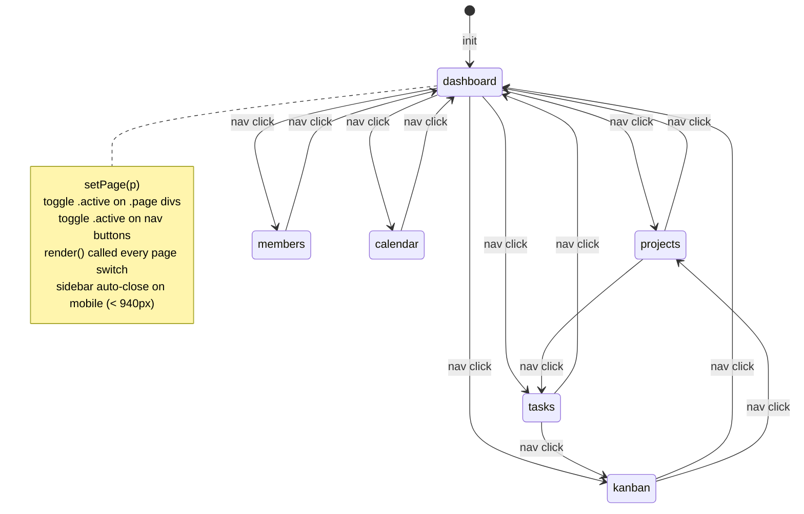
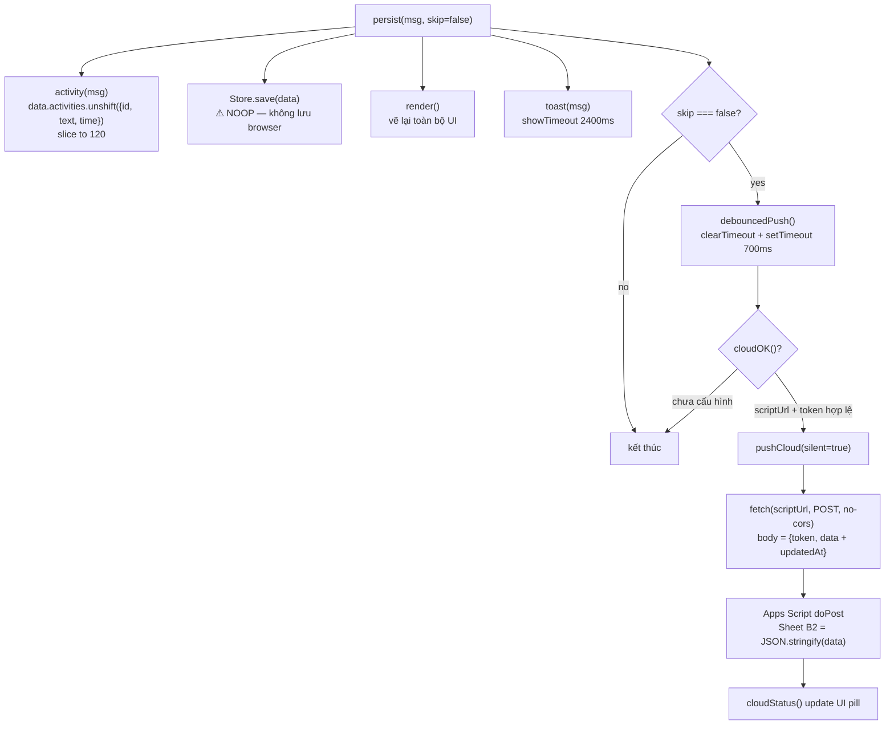
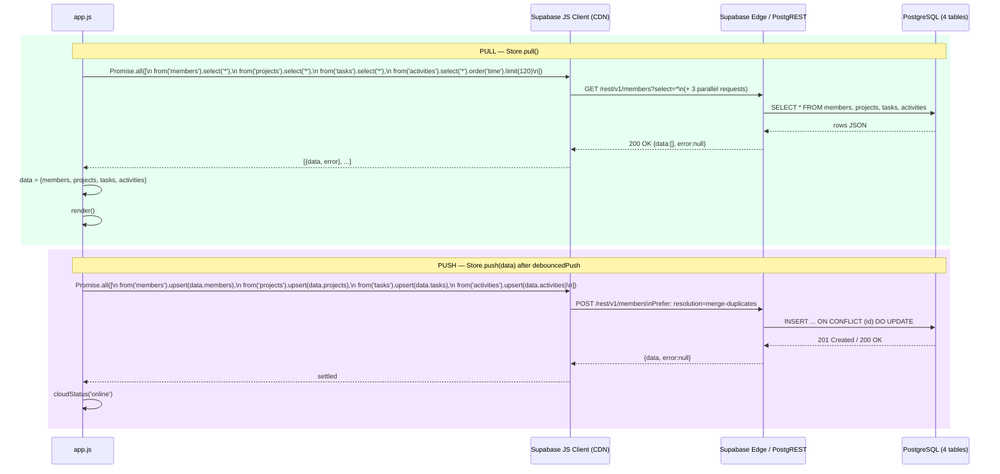
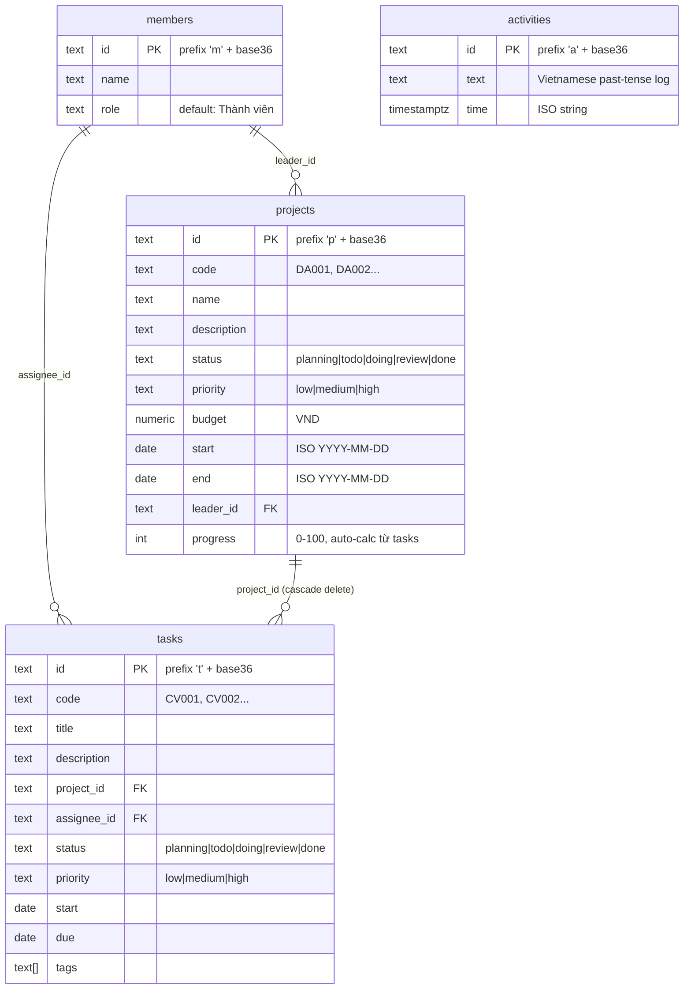
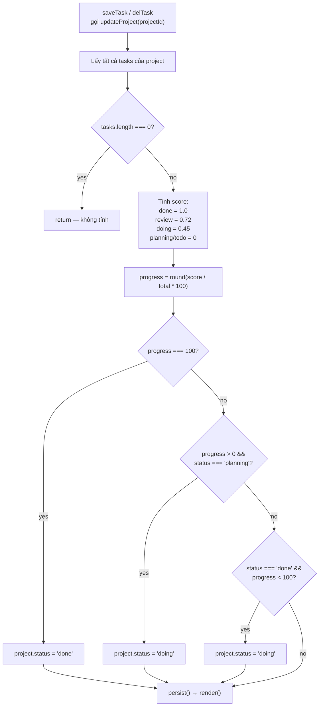
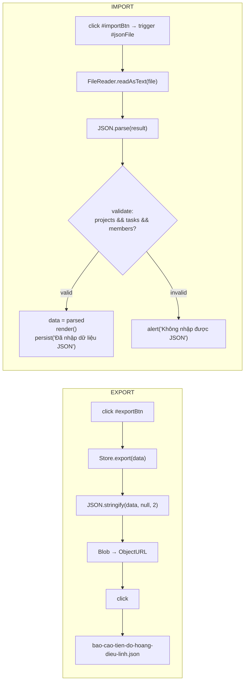

# Project Flow — Báo cáo tiến độ Kangnam

<!-- Last updated: 2026-05-15 -->

---

## 1. Script Load Order



> Load order từ `index.html:96-97`. Thứ tự bắt buộc — `app.js` gọi `Store.load()` ngay khi parse, trước `DOMContentLoaded`.

---

## 2. Khởi động (Init Sequence)



---

## 3. Điều hướng trang



---

## 4. Luồng CRUD

```mermaid
flowchart TD
    subgraph CREATE ["➕ Tạo mới"]
        C1["Click nút\n#addProject / #addTask / #addMember\n#heroProject / #heroTask / #quickAdd"]
        C2["openProject() / openTask() / openModal('memberModal')"]
        C3["Điền form"]
        C4["Submit → saveProject / saveTask / saveMember"]
        C5["id() tạo ID mới\ncode() tạo mã DA001/CV001"]
        C6["data.xxx = [newItem, ...data.xxx]"]
        C7["persist(msg)"]

        C1 --> C2 --> C3 --> C4 --> C5 --> C6 --> C7
    end

    subgraph UPDATE ["✎ Sửa"]
        U1["Click nút ✎\nopenProject(id) / openTask(id)"]
        U2["Populate form với data hiện tại"]
        U3["Submit → saveProject / saveTask"]
        U4["data.xxx = data.xxx.map(x => x.id === id ? updated : x)"]
        U5["updateProject(projectId)\ntính lại progress từ tasks"]
        U6["persist(msg)"]

        U1 --> U2 --> U3 --> U4 --> U5 --> U6
    end

    subgraph DELETE ["⌫ Xóa"]
        D1["Click nút ⌫\ndelProject / delTask / delMember"]
        D2["confirm() dialog"]
        D3["data.xxx = data.xxx.filter(x => x.id !== id)"]
        D4{"Xóa project?"}
        D5["Xóa cascade tasks\ndata.tasks.filter(t => t.projectId !== pid)"]
        D6["Reassign nếu xóa member\nassigneeId / leaderId → next member"]
        D7["persist(msg)"]

        D1 --> D2 --> D3 --> D4
        D4 -->|yes| D5 --> D7
        D4 -->|no - task/member| D6 --> D7
    end
```



---

## 5. Pipeline persist()



---

## 6. Cloud Sync hiện tại — Google Sheets

```mermaid
sequenceDiagram
    participant App as app.js
    participant DOM as DOM head
    participant GAS as Apps Script Web App
    participant Sheet as Sheet DATA!B2

    rect rgb(255, 245, 230)
        Note over App,Sheet: PULL (đọc dữ liệu)
        App->>DOM: append <script src="URL?token=X&callback=jsonp_abc&mode=json">
        DOM->>GAS: GET doGet(e)
        GAS->>GAS: verify token
        GAS->>Sheet: getRange("B2").getValue()
        Sheet-->>GAS: JSON string
        GAS-->>DOM: text/javascript: jsonp_abc({ok:true, data:{...}, updatedAt:"..."})
        DOM-->>App: execute → window.jsonp_abc() callback
        App->>App: data = j.data; render()
        App->>DOM: cleanup — remove <script>, delete window.jsonp_abc
    end

    rect rgb(230, 245, 255)
        Note over App,Sheet: PUSH (ghi dữ liệu)
        App->>GAS: fetch(url, {method:POST, mode:no-cors, body:JSON.stringify({token, data})})
        Note over App: Response là opaque — không đọc được status
        GAS->>GAS: verify token == SECRET
        GAS->>Sheet: getRange("B2").setValue(JSON.stringify(body.data))
        GAS->>Sheet: getRange("C2").setValue(timestamp)
        GAS-->>App: (opaque — bị no-cors block)
        App->>App: cloudStatus() — assume success
    end
```

---

## 7. Cloud Sync đích — Supabase



---

## 8. Render Pipeline

```mermaid
flowchart LR
    A["render()"] --> B["opts()\npopulate <select> dropdowns"]
    A --> C["stat()\n#stats cards\n#ring progress circle"]
    A --> D["chart()\nworkload bar chart per member"]
    A --> E["progress()\nproject progress list"]
    A --> F["dues()\noverdue + soon tasks"]
    A --> G["projectTable()\nfiltered table"]
    A --> H["taskTable()\nfiltered table"]
    A --> I["kanban()\n4 columns by status"]
    A --> J["members()\nmember cards"]
    A --> K["calendar()\n14-day deadline view"]
    A --> L["activityList()\ntimeline 28 items"]
    A --> M["cloudStatus()\nsync pill indicator"]

    style A fill:#e8f0f5,stroke:#4c84c9,font-weight:bold
```



> `render()` vẽ lại **toàn bộ** UI mỗi lần gọi — không có virtual DOM, không có dirty check. Chi phí thấp vì data nhỏ.

---

## 9. Data Model (ER)



---

## 10. Progress Auto-Calculation



---

## 11. Import / Export


